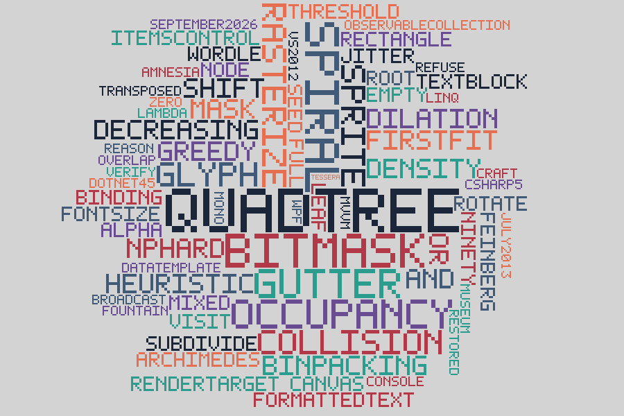

QuadTreeTagCloud
================

A tag cloud placer. Begun in July 2013, finished in September 2026, in the language of
July 2013: C# 5 on .NET 4.5, the VS2012 solution as it was. Nothing newer than the year
it was born was allowed in, and the compiler was held to `-langversion:5` to make sure.

What it was
-----------

Six commits over one week in July 2013: a quadtree that was meant to place words and a
WPF window to draw them. It never drew a cloud. Compiled untouched under Mono and driven
by its own console harness twenty thousand times, the 2013 `Core` did this:

| Runs of the original harness              | 20,000 |
|-------------------------------------------|--------|
| Threw `NullReferenceException`            | 6.3%   |
| Completed runs where only the last word survived | 100% |

Three bugs, all in `QuadTreeNode`:

1. **Three of four quadrants were transposed.** `Rectangle` takes `(top, left, …)` and
   children 1 to 3 were built as `(left, top, …)`. For a root at the origin the cells landed
   at (0,0), (0,100), (200,0), (200,100): two overlapping by half, two outside the root.
2. **Every insert wiped the tree.** `Children = new QuadTreeNode[4]` ran on every insert,
   so the occupancy record forgot every word placed before it.
3. **Insert was a broadcast.** A word small enough to subdivide was inserted into all four
   children recursively, so the one surviving word appeared 1, 4, 16, 64 or 256 times, all
   the same object, all at one position. A word reaching a cell of area 100 or less found
   null children and crashed.

Underneath the bugs was the wrong casting: the quadtree was made the *placer*, which can only
ever snap words to cell corners and produce a gappy treemap. A tag cloud has three separate
organs, and the 2013 code fused them into one.

What it is now
--------------

The three organs, kept apart on purpose:

- **Where to try** — `Cloud/Spiral.cs`. An Archimedean spiral walked outward from the
  centre; nothing more than a cheap enumerator of "the closest untried spot to the middle".
  That ordering is the whole aesthetic.
- **Is it free** — `Geometry/Mask.cs`. Every word is rasterized once into a 1-bit mask with
  rows packed into `ulong`s; the collision test is shifts and ANDs, 64 pixels per instruction.
  The board keeps everyone's ink *dilated by the gutter*, and a candidate is tested raw against
  it, so no two letters ever come closer than the gutter and words interlock where the ink
  allows — a small word can sit inside a big `C`.
- **What's taken** — `DataStructures/OccupancyBoard.cs`. Two rasters and an index.

Words go in heaviest first while space is plentiful (first-fit decreasing, still undefeated),
font size scales with the square root of weight so the top word does not eat the canvas, and
a word that finds no room is **refused with a reason** rather than shrunk to fit: a cloud that
lies about its own weights is worse than one with a word missing. Everything is seeded, so the
same tags give the same cloud every time.

`QuadTree` and `QuadTreeNode` kept their names and got the job they were born for: a region
quadtree over the board that knows which parts of the canvas are still Empty and which are
keep-out from edge to edge. Both verdicts are sound — the tree never says Empty over ink and
never says Full over a hole — and the console proves it against the mask itself.

The rasterizer is an interface. The window uses `FormattedText` and real glyphs; the console
uses two stand-ins that need no font engine at all, which is what lets the algorithm be proved
on a machine with no WPF.

Running it
----------

**Windows:** open `CloudTagWithQuadTree.sln` in VS2012 or anything later and run
`CloudTagWithQuadTree`. The title bar reports the placement.

**Anywhere with Mono:**

    mcs -langversion:5 -sdk:4.5 -target:library -out:Core.dll Core/Cloud/*.cs Core/DataStructures/*.cs Core/Enums/*.cs Core/Geometry/*.cs Core/Helpers/*.cs Core/Properties/AssemblyInfo.cs
    mcs -langversion:5 -sdk:4.5 -out:ConsoleTests.exe -r:Core.dll ConsoleTests/*.cs ConsoleTests/Properties/AssemblyInfo.cs
    mono ConsoleTests.exe

The console exits 0 only if every check passes, and writes the clouds it laid out as SVG.

What the console proves
-----------------------

Three self-checks pin the primitives against naive pixel loops: the word-level `Intersects`
against a pixel-by-pixel test on 3,000 random sprites, `Dilate` against a Chebyshev
neighbourhood, and both quadtree verdicts against the mask they index. Then two full clouds of
72 words are laid out and re-verified with code that shares nothing with the placer's own
collision path: every word inside the canvas, no ink pixel painted twice, no foreign ink
within the gutter of any ink pixel, every tag placed or refused exactly once. The solid-box
cloud is checked a second way, with pure rectangle arithmetic.

The quadtree, measured
----------------------

The console lays out each cloud twice, with the tree and without, on the same seed:

| Scenario, 72 words, 900×600  | Placement          | Candidates | Refused by tree alone | Time   |
|------------------------------|--------------------|-----------:|----------------------:|-------:|
| Solid boxes, quadtree on     | identical          |    526,488 |               171,458 | 332 ms |
| Solid boxes, quadtree off    | identical          |    526,488 |                     – |  68 ms |
| Block letters, quadtree on   | identical          |    643,506 |                    10 | 328 ms |
| Block letters, quadtree off  | identical          |    643,506 |                     – |  85 ms |

The tree is correct, sound in both directions, and at tag-cloud scale it costs more than it
saves: the bitwise test it replaces is already a handful of ANDs, and walking the tree is not.
With real glyphs it barely fires at all, because the counters of the letters keep the dense
core from ever being solid. The window keeps it on so the title bar can show the honest count;
the console shows both. The structure this repository is named after was, in the end, a
correct answer to a question the problem never asked. That is worth knowing, so it is written
down here instead of hidden behind a default.

Honest asterisks
----------------

- The WPF half was written against the .NET 4.5 API and parsed as C# 5, but the restorer had
  no WPF to run it on. `Core` and `ConsoleTests` were compiled and run under Mono; the window
  awaits a Windows machine and an F5.
- The console's block-letter font is a 5×7 dot matrix, uppercase only. The window draws
  Segoe UI. Densities in the table are for the dot matrix, which is sparse by nature.
- The 2013 `bin` and `obj` folders are still committed and no longer match the sources.
  Removing them is the owner's call.

Why
---

The problem is NP-hard: deciding whether a fixed set of rectangles fits a fixed box is bin
packing wearing a beret. But a tag cloud never asks that. It asks for every word placed,
nothing touching, dense and pleasant, on a canvas allowed to breathe — and greedy heuristics
get there in a hundred milliseconds. The theorem was real and aimed at the wrong problem.
Thirteen years is long enough to find that out, and exactly short enough to fix it while the
author who wrote the first version is around to see the cloud. For the craft.
